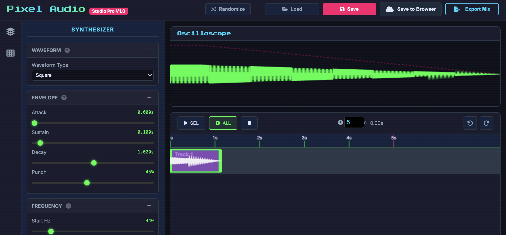

# Pixel Audio SFX Studio Pro

A professional-grade web-based sound effects generator designed for creating retro 8-bit and chip-style audio effects. Built with vanilla JavaScript and the Web Audio API, featuring a cyberpunk-inspired interface with real-time synthesis capabilities.


*Main interface showing the synthesizer controls, oscilloscope, and timeline*

## 🎵 Overview

Pixel Audio SFX Studio Pro is a powerful tool for game developers, sound designers, and electronic music enthusiasts. Create authentic 8-bit sound effects in your browser with professional-grade synthesis tools, intuitive controls, and real-time audio generation.

**Current Version:** 1.0  
**Technology Stack:** Vanilla JavaScript, Web Audio API, Canvas API, HTML5/CSS3

## ✨ Key Features

### 🎛️ Advanced Synthesizer
- **Waveform Control**: Square, Sine, Triangle, Sawtooth, and Noise generators
- **ADSR Envelope**: Attack, Sustain, Punch, and Decay parameters for dynamic shaping
- **Frequency Modulation**: Start frequency, slide, and delta-slide controls
- **Vibrato**: Depth and speed controls for pitch modulation
- **Arpeggio**: Frequency alternation for authentic chiptune effects
- **Duty Cycle**: Adjustable pulse width for square waves

### 🎚️ Layer Management
- **Multiple Audio Layers**: Create complex soundscapes by layering different effects
- **Individual Volume Control**: Fine-tune each layer's output level
- **Layer Timeline**: Visual timeline for sequencing and timing
- **Copy/Paste**: Duplicate and paste layers for rapid sound design
- **Undo/Redo**: Full history with 50-step undo/redo support

### 📊 Visual Tools
- **Real-time Oscilloscope**: Visual feedback of generated waveforms
- **Timeline Canvas**: Visual representation of sound timing and layers
- **Interactive Controls**: Live parameter adjustment with immediate audio feedback

### 🎯 Preset Library
- **Game Effects**: Pickups, Lasers, Explosions, Power-ups, Hits, Jumps, Alarms
- **Footstep Sounds**: Stone, Wood, Sand, Snow, Gravel variations
- **UI Elements**: Click, Hover, Blip, and Synth Pad sounds
- **Random Generation**: AI-powered random preset generation

### 💾 Export & Project Management
- **WAV Export**: High-quality 16-bit 44.1kHz audio export
- **Layer Export**: Export individual layers for external use
- **Mixed Output**: Export full timeline mixes
- **Browser Storage**: Save/load projects locally
- **Project Files**: Import/export complete project files

### 🎮 User Experience
- **Keyboard Shortcuts**: Professional workflow shortcuts (Space, Ctrl+S, Ctrl+Z, etc.)
- **Tooltips**: Context-sensitive help and parameter explanations
- **Responsive Design**: Optimized for desktop and tablet use
- **Progressive Enhancement**: Works without JavaScript for basic functionality

## 🚀 Getting Started

### Quick Start
1. Open `index.html` in a modern web browser (Chrome, Firefox, Safari, Edge)
2. Click anywhere on the page to activate audio context (browser requirement)
3. Select a preset from the right panel or adjust synthesizer parameters
4. Press **Play** to hear your sound effect
5. Export your creation using the **Export Mix** button

### Basic Workflow

1. **Choose a Preset**: Start with the preset library to understand the capabilities
2. **Adjust Parameters**: Use the synthesizer controls to modify the sound
3. **Add Layers**: Create complexity by adding additional sound layers
4. **Timeline Sequencing**: Arrange your effects along the timeline
5. **Export**: Save your creation as a WAV file

### Keyboard Shortcuts

| Shortcut | Action |
|----------|--------|
| `Space` | Play/Pause |
| `Ctrl+S` | Save Project |
| `Ctrl+O` | Load Project |
| `Ctrl+Z` | Undo |
| `Ctrl+Y` | Redo |
| `Ctrl+C` | Copy Layer |
| `Ctrl+V` | Paste Layer |
| `Ctrl+D` | Duplicate Layer |

## 🏗️ Technical Architecture

### Core Components

```
js/
├── audioEngine.js      # Web Audio API management and playback
├── soundGenerator.js   # Real-time audio synthesis engine
├── layerManager.js     # Multi-layer audio management
├── timeline.js         # Timeline visualization and sequencing
├── fileManager.js      # Project and audio export functionality
├── presets.js          # Built-in preset library and random generation
├── ui.js              # User interface management
└── main.js            # Application orchestration and state management
```

### Audio Processing Pipeline

1. **Synthesis**: Generate raw audio samples using Web Audio API oscillators
2. **Envelope Shaping**: Apply ADSR parameters for temporal dynamics
3. **Frequency Modulation**: Handle pitch changes, vibrato, and arpeggio
4. **Filtering**: Optional low-pass and high-pass filters
5. **Mixing**: Combine multiple layers with individual volume control
6. **Output**: Real-time playback and WAV file export

### Browser Compatibility

- **Chrome 66+**: Full support (recommended)
- **Firefox 60+**: Full support
- **Safari 11.1+**: Full support
- **Edge 79+**: Full support

*Note: Web Audio API is required for full functionality*

## 📁 Project Structure

```
pixelAudio/
├── index.html              # Main application file
├── css/
│   └── styles.css          # Cyberpunk-inspired styling
├── js/                     # Core JavaScript modules
│   ├── audioEngine.js      # Audio context and playback
│   ├── soundGenerator.js   # Synthesizer engine
│   ├── layerManager.js     # Multi-layer management
│   ├── timeline.js         # Timeline and sequencing
│   ├── fileManager.js      # Export/import functionality
│   ├── presets.js          # Preset library
│   ├── tooltip.js          # Tooltip management
│   ├── ui.js              # UI interactions
│   └── main.js            # App orchestration
├── favicon.ico             # Application icons
├── apple-touch-icon.png
├── web-app-manifest-*.png  # PWA manifest images
```

## 🎨 Design Philosophy

### Visual Style
- **Cyberpunk Aesthetic**: Terminal-inspired design with neon accents
- **Functional Minimalism**: Clean interface focused on workflow efficiency
- **Retro Computing**: Pixel-perfect UI reminiscent of 1980s terminals
- **Color Palette**: 
  - Primary: Terminal Green (#00ff41)
  - Secondary: Neon Pink (#ff006e) 
  - Tertiary: Cyan (#00d9ff)

### User Experience
- **Immediate Feedback**: Real-time audio and visual responses
- **Professional Workflow**: Industry-standard keyboard shortcuts and controls
- **Progressive Disclosure**: Advanced features available but not overwhelming
- **Accessibility**: High contrast design and keyboard navigation

## 🛠️ Development Setup

### Prerequisites
- Modern web browser with Web Audio API support
- Local web server (recommended for full functionality)
- Basic understanding of audio synthesis concepts

### Local Development

1. **Clone or download** the project files
2. **Start a local server**:
   ```bash
   # Using Python 3
   python -m http.server 8000
   
   # Using Node.js
   npx http-server
   
   # Using PHP
   php -S localhost:8000
   ```
3. **Open browser** to `http://localhost:8000`
4. **Allow audio** when prompted by your browser

### Building from Source
No build process required! This is a pure JavaScript application that runs directly in the browser.

## 📚 Usage Examples

### Creating a Laser Sound
1. Select the **Laser** preset from Game FX category
2. Adjust the **Slide** parameter to `-0.3` for descending pitch
3. Increase **Vibrato Speed** to `15` for warbling effect
4. Add a second layer with **Noise** waveform for texture
5. Export as **WAV** for use in your game

### Designing Footsteps
1. Choose **Stone** step preset
2. Reduce **Attack** to `0.005` for immediate impact
3. Increase **Punch** to `60` for attack emphasis
4. Adjust **Low-Pass Filter** to `8000Hz` for realistic tone
5. Create variations by randomizing parameters

### Building Soundscapes
1. Add multiple layers with different presets
2. Stagger timing along the timeline
3. Adjust individual layer volumes
4. Export as **Mixed Output** for complete soundscape

## 🔧 Configuration

### Audio Settings
- **Sample Rate**: 44.1kHz (standard audio quality)
- **Bit Depth**: 16-bit WAV export
- **Buffer Size**: Automatically optimized for low latency

### Storage Options
- **Browser Storage**: Save projects locally using localStorage
- **File Export**: Download project files as JSON
- **Audio Export**: Save as standard WAV format

## 🐛 Troubleshooting

### Common Issues

**No Audio Output**
- Check browser audio permissions
- Ensure Web Audio API support
- Verify speakers/headphones are connected

**Latency Issues**
- Close unnecessary browser tabs
- Use Chrome for lowest latency
- Enable hardware acceleration

**Export Problems**
- Check available disk space
- Ensure stable internet connection for large projects
- Try reducing timeline length for faster exports

**Performance Issues**
- Reduce number of active layers
- Lower audio buffer size in browser settings
- Close other audio applications

## 🤝 Contributing

We welcome contributions! Please feel free to submit issues and enhancement requests.

### Development Guidelines
- Follow existing code style and architecture
- Test across multiple browsers
- Maintain backward compatibility
- Update documentation for new features

## 📄 License

This project is open source and available under the [MIT License](LICENSE).

## 🙏 Acknowledgments

- **Web Audio API**: For providing powerful browser-based audio capabilities
- **Chip Music Community**: For inspiration and reference sounds
- **Game Audio Community**: For feedback and usage scenarios

## 📞 Support

For questions, suggestions, or bug reports:
- Create an issue in the project repository
- Check the troubleshooting section above
- Review the built-in tooltips for parameter explanations

---

**Made with ❤️ for the game audio community**

*Experience the power of retro sound synthesis in your browser*
